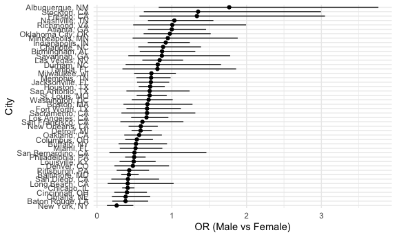
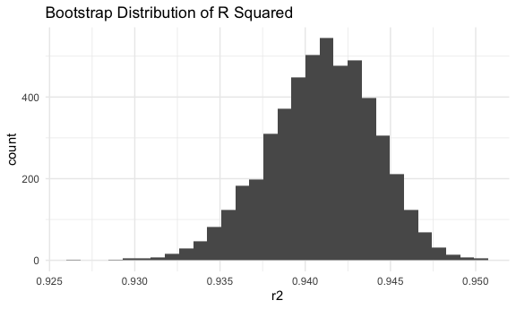
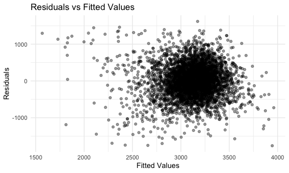

p8105_hw6_lca2149
================
2025-11-30

## Problem 1

``` r
#Import and clean data
homicide_df =
  read.csv("data/homicide-data.csv") |>
mutate(
    city_state = paste(city, state, sep = ", "),
    case_closed = ifelse(disposition == "Closed by arrest", 1, 0),
    victim_age = as.numeric(victim_age)) |>
filter(
    !(city_state %in% c("Dallas, TX", "Phoenix, AZ", "Kansas City, MO", "Tulsa, OK", "Tulsa, AL")),
    victim_race %in% c("White", "Black"))
```

    ## Warning: There was 1 warning in `mutate()`.
    ## ℹ In argument: `victim_age = as.numeric(victim_age)`.
    ## Caused by warning:
    ## ! NAs introduced by coercion

``` r
# For baltimore only, use glm to fit a logistic regression with resolved vs unresolved as the outcome.
baltimore_df <- homicide_df |>
  filter(city_state == "Baltimore, MD") 
  
fit = glm(
  case_closed ~ victim_age + victim_sex + victim_race, data = baltimore_df,
family=binomial()
)


results <- tidy(fit, exponentiate = TRUE, conf.int = TRUE)|>
    knitr::kable()
results
```

| term             |  estimate | std.error | statistic |   p.value |  conf.low | conf.high |
|:-----------------|----------:|----------:|----------:|----------:|----------:|----------:|
| (Intercept)      | 1.3633992 | 0.1712948 |  1.809635 | 0.0703525 | 0.9757573 | 1.9107826 |
| victim_age       | 0.9932953 | 0.0033235 | -2.024124 | 0.0429574 | 0.9868059 | 0.9997539 |
| victim_sexMale   | 0.4255117 | 0.1381762 | -6.183864 | 0.0000000 | 0.3241908 | 0.5575508 |
| victim_raceWhite | 2.3204389 | 0.1747162 |  4.817851 | 0.0000015 | 1.6496269 | 3.2759334 |

The adjusted OR for solving homicides comparing male victims to female
victims keeping all other variables fixed: victim_sexMale estimate =
0.43 (95% CI: 0.32 - 0.56).

``` r
# Run lgm for each of the cities in our dataset, extract adjusted OR for solving homicides comparing male victims to female victims.
city_results <-
  homicide_df |>
  group_by(city_state) |>
  nest() |>
  mutate(
    fit = map(data, ~ glm(
      case_closed ~ victim_age + victim_sex + victim_race,
      data = .x,
      family = binomial
    )),
    tidy_fit = map(fit, ~ tidy(.x, exponentiate = TRUE, conf.int = TRUE))
  ) |>
  unnest(tidy_fit) |>
  filter(term == "victim_sexMale") |>   
  select(
    city_state,
    or = estimate,
    conf.low,
    conf.high,
    p.value
  )
```

    ## Warning: There were 45 warnings in `mutate()`.
    ## The first warning was:
    ## ℹ In argument: `tidy_fit = map(fit, ~tidy(.x, exponentiate = TRUE, conf.int =
    ##   TRUE))`.
    ## ℹ In group 1: `city_state = "Albuquerque, NM"`.
    ## Caused by warning:
    ## ! glm.fit: fitted probabilities numerically 0 or 1 occurred
    ## ℹ Run `dplyr::last_dplyr_warnings()` to see the 44 remaining warnings.

``` r
city_results |>
   knitr::kable()
```

| city_state         |        or |  conf.low | conf.high |   p.value |
|:-------------------|----------:|----------:|----------:|----------:|
| Albuquerque, NM    | 1.7674995 | 0.8247081 | 3.7618600 | 0.1392989 |
| Atlanta, GA        | 1.0000771 | 0.6803477 | 1.4582575 | 0.9996829 |
| Baltimore, MD      | 0.4255117 | 0.3241908 | 0.5575508 | 0.0000000 |
| Baton Rouge, LA    | 0.3814393 | 0.2043481 | 0.6836343 | 0.0016535 |
| Birmingham, AL     | 0.8700153 | 0.5713814 | 1.3138409 | 0.5111455 |
| Boston, MA         | 0.6739912 | 0.3534469 | 1.2768225 | 0.2256969 |
| Buffalo, NY        | 0.5205704 | 0.2884416 | 0.9358300 | 0.0289521 |
| Charlotte, NC      | 0.8838976 | 0.5507440 | 1.3905954 | 0.6004077 |
| Chicago, IL        | 0.4100982 | 0.3361233 | 0.5008546 | 0.0000000 |
| Cincinnati, OH     | 0.3998277 | 0.2313767 | 0.6670456 | 0.0006485 |
| Columbus, OH       | 0.5324845 | 0.3770457 | 0.7479124 | 0.0003039 |
| Denver, CO         | 0.4790620 | 0.2327380 | 0.9624974 | 0.0410964 |
| Detroit, MI        | 0.5823472 | 0.4619454 | 0.7335458 | 0.0000045 |
| Durham, NC         | 0.8123514 | 0.3824420 | 1.6580169 | 0.5761077 |
| Fort Worth, TX     | 0.6689803 | 0.3935128 | 1.1211603 | 0.1311687 |
| Fresno, CA         | 1.3351647 | 0.5672553 | 3.0475080 | 0.4963822 |
| Houston, TX        | 0.7110264 | 0.5569844 | 0.9057376 | 0.0059322 |
| Indianapolis, IN   | 0.9187284 | 0.6784616 | 1.2413059 | 0.5818930 |
| Jacksonville, FL   | 0.7198144 | 0.5359236 | 0.9650986 | 0.0283233 |
| Las Vegas, NV      | 0.8373078 | 0.6058830 | 1.1510854 | 0.2776086 |
| Long Beach, CA     | 0.4102163 | 0.1427304 | 1.0241775 | 0.0717631 |
| Los Angeles, CA    | 0.6618816 | 0.4565014 | 0.9541036 | 0.0279274 |
| Louisville, KY     | 0.4905546 | 0.3014879 | 0.7836391 | 0.0033700 |
| Memphis, TN        | 0.7232194 | 0.5261210 | 0.9835973 | 0.0420463 |
| Miami, FL          | 0.5152379 | 0.3040214 | 0.8734480 | 0.0134772 |
| Milwaukee, wI      | 0.7271327 | 0.4951325 | 1.0542297 | 0.0976722 |
| Minneapolis, MN    | 0.9469587 | 0.4759016 | 1.8809745 | 0.8757279 |
| Nashville, TN      | 1.0342379 | 0.6807452 | 1.5559966 | 0.8728884 |
| New Orleans, LA    | 0.5849373 | 0.4218807 | 0.8121787 | 0.0013105 |
| New York, NY       | 0.2623978 | 0.1327512 | 0.4850117 | 0.0000454 |
| Oakland, CA        | 0.5630819 | 0.3637421 | 0.8671086 | 0.0093743 |
| Oklahoma City, OK  | 0.9740747 | 0.6228507 | 1.5199721 | 0.9079362 |
| Omaha, NE          | 0.3824861 | 0.1988357 | 0.7109316 | 0.0029514 |
| Philadelphia, PA   | 0.4962756 | 0.3760120 | 0.6498797 | 0.0000005 |
| Pittsburgh, PA     | 0.4307528 | 0.2626022 | 0.6955518 | 0.0006724 |
| Richmond, VA       | 1.0060520 | 0.4834671 | 1.9936248 | 0.9865837 |
| San Antonio, TX    | 0.7046200 | 0.3928179 | 1.2382509 | 0.2303369 |
| Sacramento, CA     | 0.6688418 | 0.3262733 | 1.3143888 | 0.2548059 |
| Savannah, GA       | 0.8669817 | 0.4185827 | 1.7802453 | 0.6973523 |
| San Bernardino, CA | 0.5003444 | 0.1655367 | 1.4623977 | 0.2056661 |
| San Diego, CA      | 0.4130248 | 0.1913527 | 0.8301847 | 0.0172175 |
| San Francisco, CA  | 0.6075362 | 0.3116925 | 1.1551470 | 0.1336164 |
| St. Louis, MO      | 0.7031665 | 0.5298505 | 0.9319005 | 0.0143877 |
| Stockton, CA       | 1.3517273 | 0.6256427 | 2.9941299 | 0.4474507 |
| Tampa, FL          | 0.8077029 | 0.3395253 | 1.8598834 | 0.6193928 |
| Washington, DC     | 0.6901713 | 0.4653608 | 1.0122516 | 0.0608080 |

``` r
# Make Plots
ggplot(city_results, aes(x=reorder(city_state, or), y=or)) + geom_point() + geom_errorbar(aes(ymin = conf.low, ymax = conf.high), width = 0) +
  coord_flip() +
  labs(x = "City", y = "OR (Male vs Female)") 
```



## Problem 2

``` r
# Import Datasets
library(p8105.datasets)
data("weather_df")
```

``` r
# Write a function
boot_estimates = function(df) {
  
  fit = lm(tmax ~ tmin + prcp, data = df)
  
  broom_coef = tidy(fit)
  broom_glance = glance(fit)
  
  beta1 = broom_coef$estimate[broom_coef$term == "tmin"]
  beta2 = broom_coef$estimate[broom_coef$term == "prcp"]
  
  tibble(
    r2 = broom_glance$r.squared,
    beta_product = beta1 * beta2
  )
}
```

``` r
set.seed(1)

boot_results =
  tibble(iter = 1:5000) |>
  mutate(
    strap = map(iter, ~ sample_frac(weather_df, replace = TRUE)),
results = map(strap, boot_estimates)) |>
  select(-strap) |>
  unnest(results)
```

``` r
# Plot the distributions
boot_results |>
  ggplot(aes(x=r2)) +
  geom_histogram() +
  labs(title = "Bootstrap Distribution of R Squared")
```

    ## `stat_bin()` using `bins = 30`. Pick better value with `binwidth`.


The boostrap distribution of R squared is very tight and unimodal,
centered around ~0.940. This indicates that there is very little
uncertaintly and r squared is very stable for this dataset.

``` r
boot_results |>
  ggplot(aes(x=beta_product)) +
  geom_histogram() +
  labs(title = "Boostrap Distribution of Beta 1 and 2")
```

    ## `stat_bin()` using `bins = 30`. Pick better value with `binwidth`.


The beta product distribution is consistently negative and fairly
tightly clustered, meaning this relationship is stable and not very
sensitive to sampling variation.

``` r
ci_r2 =
  boot_results %>%
  summarize(
    lower = quantile(r2, 0.025),
    upper = quantile(r2, 0.975)
  )
```

95% CI (0.934 - 0.947)

``` r
ci_beta_product =
  boot_results %>%
  summarize(
    lower = quantile(beta_product, 0.025),
    upper = quantile(beta_product, 0.975)
  )
```

95% CI (-0.008-0.004)

## Problem 3

``` r
# Import and Clean Data
birthweight_df =
  read.csv("data/birthweight.csv") |>
  janitor::clean_names()


# Clean and prepare variables
birthweight_df = 
  birthweight_df |> 
  mutate(
    babysex = factor(babysex, levels = c(1, 2), labels = c("male", "female")),
    malform = factor(malform, levels = c(0, 1), labels = c("absent", "present")),
    mrace = factor(mrace,
                   levels = c(1, 2, 3, 4, 8),
                   labels = c("white", "black", "asian", "puerto_rican", "other")),
    frace = factor(frace,
                   levels = c(1, 2, 3, 4, 8, 9),
                   labels = c("white", "black", "asian", "puerto_rican", "other", "unknown"))
  )

# Check for missing data
birthweight_df |> 
  summarize(across(everything(), ~sum(is.na(.))))
```

    ##   babysex bhead blength bwt delwt fincome frace gaweeks malform menarche
    ## 1       0     0       0   0     0       0     0       0       0        0
    ##   mheight momage mrace parity pnumlbw pnumsga ppbmi ppwt smoken wtgain
    ## 1       0      0     0      0       0       0     0    0      0      0

I imported and cleaned the data, converting some cateogical numeric
variables to factors and confirmed that there was no missing data.

``` r
# Propose a model
bw_model = lm(bwt ~ gaweeks + momage + ppbmi + ppwt + smoken,
              data = birthweight_df)

summary(bw_model)
```

    ## 
    ## Call:
    ## lm(formula = bwt ~ gaweeks + momage + ppbmi + ppwt + smoken, 
    ##     data = birthweight_df)
    ## 
    ## Residuals:
    ##      Min       1Q   Median       3Q      Max 
    ## -1760.90  -271.42    -1.04   288.25  1618.27 
    ## 
    ## Coefficients:
    ##             Estimate Std. Error t value Pr(>|t|)    
    ## (Intercept)  94.8693    99.4670   0.954     0.34    
    ## gaweeks      64.0969     2.1936  29.220  < 2e-16 ***
    ## momage        9.6202     1.8014   5.340 9.76e-08 ***
    ## ppbmi       -32.2886     4.1495  -7.781 8.91e-15 ***
    ## ppwt          8.2938     0.6591  12.584  < 2e-16 ***
    ## smoken       -7.3770     0.9307  -7.926 2.86e-15 ***
    ## ---
    ## Signif. codes:  0 '***' 0.001 '**' 0.01 '*' 0.05 '.' 0.1 ' ' 1
    ## 
    ## Residual standard error: 452.1 on 4336 degrees of freedom
    ## Multiple R-squared:  0.2216, Adjusted R-squared:  0.2207 
    ## F-statistic: 246.8 on 5 and 4336 DF,  p-value: < 2.2e-16

I built this model by including factors I know influence birthweight
such as maternal health, lifestyle, and genetic factors. I chose a model
focusing on maternal characteristics and behaviors that are biologically
linked to fetal growth. I found that gestational age was by far the
greatest predictor of birthweight. Maternal age and weight increased
birthweight, while smoking and higher BMI decreased it.

``` r
# Residuals vs Fitted Plot
birthweight_df |> 
  add_predictions(bw_model) |> 
  add_residuals(bw_model) |> 
  ggplot(aes(x = pred, y = resid)) +
  geom_point(alpha=0.4) +
  labs(
    title = "Residuals vs Fitted Values",
    x = "Fitted Values",
    y = "Residuals"
  ) 
```



``` r
# Comparing my model to two others
bw_model2 = lm(bwt ~ blength + gaweeks,
              data = birthweight_df)
summary(bw_model2)
```

    ## 
    ## Call:
    ## lm(formula = bwt ~ blength + gaweeks, data = birthweight_df)
    ## 
    ## Residuals:
    ##     Min      1Q  Median      3Q     Max 
    ## -1709.6  -215.4   -11.4   208.2  4188.8 
    ## 
    ## Coefficients:
    ##              Estimate Std. Error t value Pr(>|t|)    
    ## (Intercept) -4347.667     97.958  -44.38   <2e-16 ***
    ## blength       128.556      1.990   64.60   <2e-16 ***
    ## gaweeks        27.047      1.718   15.74   <2e-16 ***
    ## ---
    ## Signif. codes:  0 '***' 0.001 '**' 0.01 '*' 0.05 '.' 0.1 ' ' 1
    ## 
    ## Residual standard error: 333.2 on 4339 degrees of freedom
    ## Multiple R-squared:  0.5769, Adjusted R-squared:  0.5767 
    ## F-statistic:  2958 on 2 and 4339 DF,  p-value: < 2.2e-16

``` r
bw_model3 = lm(bwt ~ bhead * blength * babysex,
                data = birthweight_df) 
summary(bw_model3)
```

    ## 
    ## Call:
    ## lm(formula = bwt ~ bhead * blength * babysex, data = birthweight_df)
    ## 
    ## Residuals:
    ##      Min       1Q   Median       3Q      Max 
    ## -1132.99  -190.42   -10.33   178.63  2617.96 
    ## 
    ## Coefficients:
    ##                               Estimate Std. Error t value Pr(>|t|)    
    ## (Intercept)                 -7176.8170  1264.8397  -5.674 1.49e-08 ***
    ## bhead                         181.7956    38.0542   4.777 1.84e-06 ***
    ## blength                       102.1269    26.2118   3.896 9.92e-05 ***
    ## babysexfemale                6374.8684  1677.7669   3.800 0.000147 ***
    ## bhead:blength                  -0.5536     0.7802  -0.710 0.478012    
    ## bhead:babysexfemale          -198.3932    51.0917  -3.883 0.000105 ***
    ## blength:babysexfemale        -123.7729    35.1185  -3.524 0.000429 ***
    ## bhead:blength:babysexfemale     3.8781     1.0566   3.670 0.000245 ***
    ## ---
    ## Signif. codes:  0 '***' 0.001 '**' 0.01 '*' 0.05 '.' 0.1 ' ' 1
    ## 
    ## Residual standard error: 287.7 on 4334 degrees of freedom
    ## Multiple R-squared:  0.6849, Adjusted R-squared:  0.6844 
    ## F-statistic:  1346 on 7 and 4334 DF,  p-value: < 2.2e-16

``` r
# Compare models
set.seed(1)
cv_df <- crossv_mc(birthweight_df, 100)

# Model 1 CV RMSE
cv_df <- cv_df |> 
  mutate(
    mod1 = map(train, ~ lm(bwt ~ gaweeks + momage + pnumlbw + ppbmi + ppwt + smoken, 
                           data = .x)),
    rmse_mod1 = map2_dbl(mod1, test, ~ rmse(.x, .y))
  )

# Model 2 CV RMSE
cv_df <- cv_df |> 
  mutate(
    mod2 = map(train, ~ lm(bwt ~ blength + gaweeks, data = .x)),
    rmse_mod2 = map2_dbl(mod2, test, ~ rmse(.x, .y))
  )

# Model 3 CV RMSE
cv_df <- cv_df |> 
  mutate(
    mod3 = map(train, ~ lm(bwt ~ bhead * blength * babysex, data = .x)),
    rmse_mod3 = map2_dbl(mod3, test, ~ rmse(.x, .y))
  )

cv_results <- cv_df |> 
  summarise(
    mean_rmse_mod1 = mean(rmse_mod1),
    mean_rmse_mod2 = mean(rmse_mod2),
    mean_rmse_mod3 = mean(rmse_mod3)
  )

cv_results
```

    ## # A tibble: 1 × 3
    ##   mean_rmse_mod1 mean_rmse_mod2 mean_rmse_mod3
    ##            <dbl>          <dbl>          <dbl>
    ## 1           454.           332.           289.

As we can see, model three has the lowest RMSE and is therefore the most
accurate. As expected, more detailed measurements and interactions
improve predictive accuracy.
